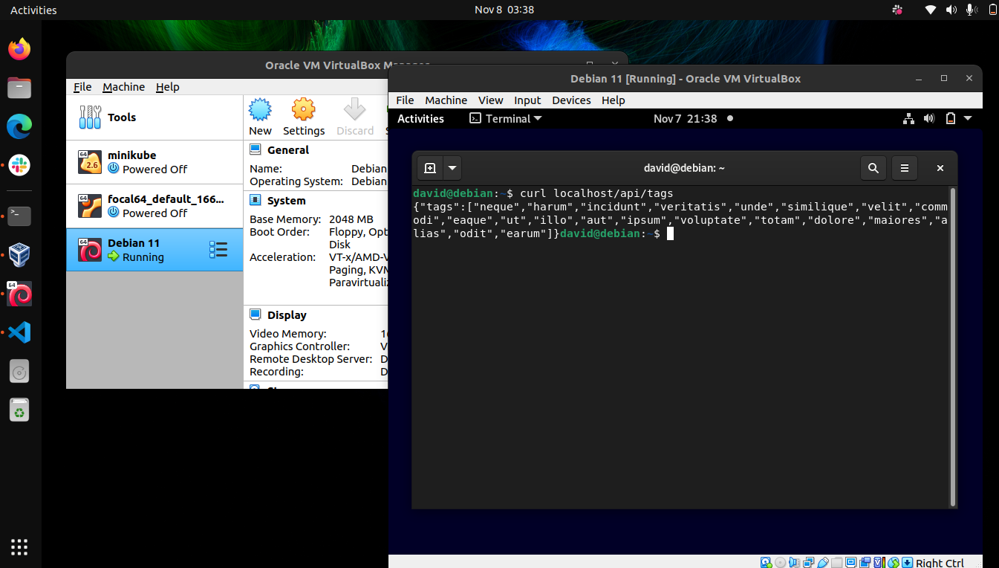

# Mini-Project: Deploy Laravel Using Apache

### Resources Used...
- Setting up Debian 11 on VBox: https://linuxopsys.com/topics/install-debian-on-virtualbox
- 

I don't know what to submit for the mini-project, but here's proof that I did it...

