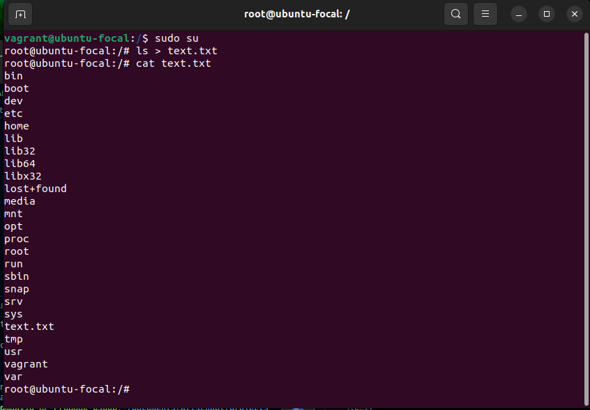

# 10 Commands

# What is a Linux Command?

Linux is a family of open-source Unix-like operating systems based on the Linux kernel. The Linux command is a utility of the Linux operating system. All basic and advanced tasks can be done by executing commands. The commands are executed on the Linux terminal. The terminal is a command-line interface to interact with the system, which is similar to the command prompt in the Windows OS. Commands in Linux are case-sensitive.


# 1. __Linux Sytem Management Command__
(__systemctl Command__)

The systemctl command is a utility which is responsible for examining and controlling the systemd system and service manager. It is a collection of system management libraries, utilities and daemons which function as a successor to the System V init daemon. The new systemctl commands have proven quite useful in managing a servers services

Syntax:

```$ systemctl status snapd```

output:


# 2. __Linux I/O Redirection__ (__< > Command__)

Redirection can be defined as changing the way from where commands read input to where commands sends output. You can redirect input and output of a command. For redirection, meta characters are used. Redirection can be into a file (shell meta characters are angle brackets '<', '>') or a program ( shell meta characters are pipesymbol '|').

Syntax:

```$ ls > text.txt```

Output:



# 3. __Linux Shell Commands__ (**type command**)

Linux 'type' command tell us whether a command given to the shell is a built-in or external command.

Syntax:

```$ type ls```

Output:


# 4. __Basic Unix Tools (date command)__

The date command is basic utility, and it can be used by executing without any argument. It will display the current date and time. Consider the below command

Syntax:

```$ date```

Output:


# 5. Linux Filters (cut command)

Linux cut command is useful for selecting a specific column of a file. It is used to cut a specific sections by byte position, character, and field and writes them to standard output. It cuts a line and extracts the text data. It is necessary to pass an argument with it; otherwise, it will throw an error message. To cut a specific section, it is necessary to specify the delimiter. A delimiter will decide how the sections are separated in a text file. Delimiters can be a space (' '), a hyphen (-), a slash (/), or anything else. After '-f' option, the column number is mentioned.

Syntax:

```$ cut -d- -f2 cutfile.txt```

Output:


# 6. Linux File Ownership (chmod command)

Command chown is used to change the owner of the file.

Syntax:

```$ chmod ugo+x file-1```

Output:


# 7. Linux Filesystem Hierarchy Standard

All the directories in the Linux system comes under the root directory which is represented by a forward slash (/). Everything in your system can be found under this root directory even if they are stored in different virtual or physical devices.

Syntax:

```$ cd /```

Output:


# 8. Linux System Admin Command (who command)

Same as w but doesn't show current process

Syntax:

```$ whoami```

Output:


# 9. su Command

Switch from one to another user (e.g from vagrant to root)

Syntax:

```$ sudo su```

Output:


# 10. users Command

Show current logged in users

Syntax:

```$ users```

Output:


# *...The End*